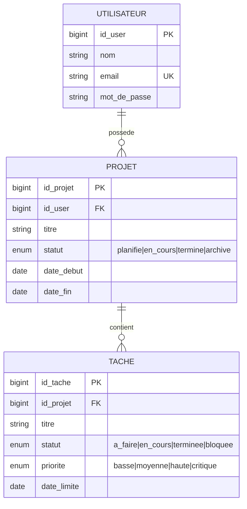

# Apollo Energy Asset Manager

A full-stack web application for **Apollo Green Solutions** to manage and monitor renewable-energy projects and the tasks associated with them.

- **Backend:** Laravel 12 (PHP 8.4) — REST API, JWT authentication, PostgreSQL
- **Frontend:** React 19 + TypeScript (TanStack Start / TanStack Router) — dashboard, Kanban board, project & task management
- **Database:** PostgreSQL 17
- **Infrastructure:** Docker Compose (Nginx, Redis, Mailpit for local email testing)

---

## Demo

https://omar21123.github.io/assets/img/posts/apollo-energy-manager/demo.mp4

> A short walkthrough of the dashboard, project/task management, and the drag-and-drop Kanban board.

---

## Table of Contents

- [Demo](#demo)
- [Features](#features)
- [Tech Stack](#tech-stack)
- [Data Model](#data-model)
- [Quick Start (Docker)](#quick-start-docker)
- [Docker Cheat Sheet](#docker-cheat-sheet)
- [Manual Setup (Without Docker)](#manual-setup-without-docker)
- [Environment Variables](#environment-variables)
- [Database Migrations](#database-migrations)
- [API Overview](#api-overview)
- [Design Choices](#design-choices)
- [Project Structure](#project-structure)
- [Troubleshooting](#troubleshooting)

---

## Features

- **User authentication:** registration, email verification, login, logout, "current user" endpoint, profile update, change password, forgot/reset password.
- **Projects:** create, list, view, update, delete — scoped to the authenticated user.
- **Tasks:** create, list, view, update, delete — each task belongs to a project and to the user who created it.
- **Dashboard:** live KPIs (total projects, active projects, total tasks, overdue tasks, completion rate) and a recent-activity feed.
- **Kanban board & task list:** drag-and-drop status updates, search, and filter by status/priority.

---

## Tech Stack

| Layer | Technology |
|---|---|
| Backend | Laravel 12, PHP 8.4, `tymon/jwt-auth` (JWT), Eloquent ORM |
| Frontend | React 19, TypeScript, TanStack Start/Router, TanStack Query, React Hook Form + Zod, Tailwind CSS, shadcn/ui |
| Database | PostgreSQL 17 |
| Cache / Queue | Redis 8 |
| Mail (dev) | Mailpit (catches verification/reset emails locally) |
| Web server | Nginx (fronting the backend) |
| Containerization | Docker & Docker Compose |

---

## Data Model



**Business rules:**
1. A user must own at least one project to be useful, but can also have none.
2. A project belongs to exactly one user.
3. A project can contain zero, one, or many tasks.
4. Each task belongs to exactly one project.
5. `id_user`, `id_projet`, and `id_tache` are unique and never reused (soft deletes are used, so IDs are not recycled after deletion).

---

## Quick Start (Docker)

This is the recommended path — it gives every contributor an identical environment (Nginx, PostgreSQL, Redis, Mailpit) with a single command.

### Prerequisites

| Requirement | Notes |
|---|---|
| Docker Engine | v24+ recommended |
| Docker Compose plugin | `docker compose version` should work |
| Git | to clone the repository |

### Step-by-step setup

**1. Clone the repository**

```bash
git clone https://github.com/omar21123/apollo-energy-manager.git
cd apollo-energy-manager
```

**2. Create the root `.env` file** (consumed by the `postgres` service in `docker-compose.yml`)

```bash
cp .env.example .env
```

Open `.env` and set your local Postgres credentials:

```dotenv
DB_DATABASE=apollo
DB_USERNAME=apollo
DB_PASSWORD=change_me
```

> ⚠️ These three values must match the `DB_*` values you put in `app/backend/.env` in the next step, since both files point at the same database.

**3. Create the backend `.env` file from `.env.example`**

```bash
cp app/backend/.env.example app/backend/.env
```

Open `app/backend/.env` and set at minimum:

```dotenv
DB_CONNECTION=pgsql
DB_HOST=postgres
DB_PORT=5432
DB_DATABASE=apollo
DB_USERNAME=apollo
DB_PASSWORD=change_me

FRONTEND_URL=http://localhost:8080

MAIL_MAILER=smtp
MAIL_HOST=mailpit
MAIL_PORT=1025

REDIS_HOST=redis

# APP_KEY and JWT_SECRET are left empty here — they are generated in step 5
```

**4. Create the frontend `.env` file**

```bash
cp app/frontend/.env.example app/frontend/.env
```

Open `app/frontend/.env` and confirm it points at the Docker backend:

```dotenv
VITE_API_URL=http://localhost/api
```

**5. Build and start every service in the background**

```bash
docker compose up -d --build
```

**6. Generate the Laravel application key and JWT secret**

```bash
docker exec -it apollo_backend php artisan key:generate
docker exec -it apollo_backend php artisan jwt:secret
```

**7. Run the database migrations**

```bash
docker exec -it apollo_backend php artisan migrate
```

See [Database Migrations](#database-migrations) below for details on what this does and how to reset the database if needed.

**8. (Optional) Seed a test user**

```bash
docker exec -it apollo_backend php artisan db:seed
```

### Access the app

| Service | URL |
|---|---|
| Backend API (via Nginx) | http://localhost/api |
| Frontend | http://localhost:8080 |
| Mailpit (captured emails) | http://localhost:8025 |
| PostgreSQL | localhost:5432 |
| Redis | localhost:6379 |

---

## Docker Cheat Sheet

```bash
# Start all services (build if needed, run in background)
docker compose up -d --build

# Start without rebuilding
docker compose up -d

# Stop all services (containers removed, volumes kept)
docker compose down

# Stop and also remove named volumes (⚠ deletes DB data)
docker compose down -v

# List running containers for this project
docker compose ps
# or, equivalently:
docker ps

# Follow logs for every service
docker compose logs -f

# Follow logs for a single service
docker compose logs -f backend
docker compose logs -f frontend

# Restart one container after a config change
docker restart apollo_backend

# Open a shell inside a container
docker exec -it apollo_backend bash
docker exec -it apollo_frontend sh

# Run an Artisan command inside the backend container
docker exec -it apollo_backend php artisan migrate
docker exec -it apollo_backend php artisan migrate:fresh --seed
docker exec -it apollo_backend php artisan config:clear
docker exec -it apollo_backend php artisan cache:clear
docker exec -it apollo_backend php artisan route:list

# Run Composer inside the backend container
docker exec -it apollo_backend composer install

# Run npm inside the frontend container
docker exec -it apollo_frontend npm install
docker exec -it apollo_frontend npm run lint

# Rebuild a single service after dependency changes
docker compose up -d --build backend
docker compose up -d --build frontend

# Check container resource usage
docker stats

# Remove stopped containers, unused networks/images (careful — global cleanup)
docker system prune
```

**Typical "something changed and it's not picking up" fix:**

```bash
docker exec -it apollo_backend php artisan config:clear
docker restart apollo_backend
```

---

## Manual Setup (Without Docker)

### Prerequisites

| Requirement | Notes |
|---|---|
| PHP 8.4+ | with extensions `pdo_pgsql`, `pgsql`, `mbstring`, `exif`, `pcntl`, `bcmath`, `gd`, `zip` |
| Composer 2 | PHP dependency manager |
| Node.js 22+ and npm | for the frontend |
| PostgreSQL 17 | running locally or reachable remotely |
| Redis (optional) | only needed if you don't want to use the database-backed cache/session/queue drivers |
| SMTP catcher (optional) | Mailpit or Mailhog locally, or just set `MAIL_MAILER=log` |

### 1. Backend (Laravel API)

```bash
cd app/backend

# Install PHP dependencies
composer install

# Create your environment file from the example
cp .env.example .env
```

Edit `app/backend/.env`:

```dotenv
DB_CONNECTION=pgsql
DB_HOST=127.0.0.1
DB_PORT=5432
DB_DATABASE=apollo
DB_USERNAME=<your local postgres user>
DB_PASSWORD=<your local postgres password>

FRONTEND_URL=http://localhost:5173

MAIL_MAILER=log
# or MAIL_MAILER=smtp + Mailpit settings if you're running one locally
```

```bash
# Generate the application key
php artisan key:generate

# Generate the JWT secret
php artisan jwt:secret

# Create the database (if it doesn't exist yet)
createdb apollo

# Run the migrations
php artisan migrate

# (optional) seed a test user
php artisan db:seed

# Start the API server
php artisan serve
```

The API is now available at `http://127.0.0.1:8000/api`.

> **Tip:** `composer run dev` (defined in `composer.json`) starts the Laravel server, the queue listener, `artisan pail` (log tailing), and the frontend Vite dev server together, if you'd rather run everything from the backend folder.

### 2. Frontend (React + TypeScript)

```bash
cd app/frontend

# Install dependencies
npm install

# Create your environment file from the example
cp .env.example .env
```

Open `app/frontend/.env` and point it at your locally running backend:

```dotenv
VITE_API_URL=http://127.0.0.1:8000/api
```

```bash
# Start the dev server
npm run dev -- --host 0.0.0.0
```

The frontend is now available at `http://localhost:5173` (Vite's default port; check your terminal output for the exact port TanStack Start binds to).

### 3. Building for production (frontend)

```bash
cd app/frontend
npm run build
npm run preview   # serves the production build locally for a sanity check
```

For a real deployment, serve the contents of the build output through Nginx or a static host, rather than running `npm run dev`.

---

## Environment Variables

### Root `.env` (created from the root `.env.example`, consumed by `docker-compose.yml` for the Postgres container)

| Variable | Description |
|---|---|
| `DB_DATABASE` | PostgreSQL database name |
| `DB_USERNAME` | PostgreSQL user |
| `DB_PASSWORD` | PostgreSQL password |

### `app/backend/.env` (Laravel — created from `app/backend/.env.example`)

| Variable | Description | Example |
|---|---|---|
| `APP_KEY` | Laravel encryption key | generated via `artisan key:generate` |
| `APP_URL` | Base URL of the API | `http://localhost` |
| `FRONTEND_URL` | Used to build email links (verification, password reset) | `http://localhost:8080` |
| `DB_CONNECTION` | Database driver | `pgsql` |
| `DB_HOST` | Database host | `postgres` (Docker) / `127.0.0.1` (local) |
| `DB_PORT` | Database port | `5432` |
| `DB_DATABASE` / `DB_USERNAME` / `DB_PASSWORD` | Database credentials — must match the root `.env` when using Docker | |
| `JWT_SECRET` | JWT signing secret | generated via `artisan jwt:secret` |
| `JWT_TTL` | Access token lifetime in minutes | `60` |
| `MAIL_MAILER` | Mail driver | `smtp` (Docker/Mailpit) or `log` |
| `MAIL_HOST` / `MAIL_PORT` | SMTP host/port | `mailpit` / `1025` (Docker) |
| `REDIS_HOST` | Redis host, if used | `redis` (Docker) / `127.0.0.1` (local) |

### `app/frontend/.env` (created from `app/frontend/.env.example`)

| Variable | Description | Example |
|---|---|---|
| `VITE_API_URL` | Base URL the frontend uses to call the API | `http://localhost/api` (Docker) or `http://127.0.0.1:8000/api` (local) |

---

## Database Migrations

The schema (users, projects, tasks, plus supporting Laravel tables such as `password_reset_tokens`, `failed_jobs`, etc.) is defined entirely through Laravel migration files in `app/backend/database/migrations/`. No manual SQL is required.

### Running migrations

**Docker:**

```bash
docker exec -it apollo_backend php artisan migrate
```

**Local (manual setup):**

```bash
cd app/backend
php artisan migrate
```

This creates every table defined by the migration files, in order, inside the database configured by `DB_*` in `app/backend/.env`.

### Other useful migration commands

| Command | What it does |
|---|---|
| `php artisan migrate` | Run any migrations that haven't been applied yet |
| `php artisan migrate:status` | Show which migrations have run |
| `php artisan migrate:rollback` | Undo the last batch of migrations |
| `php artisan migrate:fresh` | Drop **all** tables and re-run every migration from scratch (⚠ deletes all data) |
| `php artisan migrate:fresh --seed` | Same as above, then run the database seeders |
| `php artisan db:seed` | Populate the database with a test user / sample data, without touching the schema |

Prefix any of these with `docker exec -it apollo_backend` when running against the Docker setup, e.g.:

```bash
docker exec -it apollo_backend php artisan migrate:fresh --seed
```

> **Note on soft deletes:** because `users`, `projects`, and `tasks` use Laravel soft deletes, rows are never physically removed by normal delete operations — they're flagged with a `deleted_at` timestamp. Only `migrate:fresh` (or a manual `DROP TABLE`) actually clears data.

---

## API Overview

Base path: `/api`

| Method | Endpoint | Auth | Description |
|---|---|---|---|
| POST | `/auth/register` | Public | Register a new user |
| POST | `/auth/login` | Public | Log in, returns a JWT |
| POST | `/auth/forgot-password` | Public | Send a password reset email |
| POST | `/auth/reset-password` | Public | Reset password with a token |
| GET | `/auth/reset-password/validate` | Public | Validate a reset token before showing the form |
| GET | `/email/verify/{id}/{hash}` | Signed link | Verify email, redirects to the frontend |
| POST | `/auth/email/verify` | JWT | Resend the verification email |
| POST | `/auth/logout` | JWT | Invalidate the current token |
| GET | `/auth/me` | JWT | Get the current user |
| PUT | `/auth/profile` | JWT | Update profile fields |
| PUT | `/auth/change-password` | JWT | Change password |
| GET/POST | `/projects` | JWT | List / create projects |
| GET/PUT/DELETE | `/projects/{id}` | JWT | Show / update / delete a project |
| GET/POST | `/tasks` | JWT | List / create tasks |
| GET/PUT/DELETE | `/tasks/{id}` | JWT | Show / update / delete a task |

Send the JWT as `Authorization: Bearer <token>` on every protected request.

---

## Design Choices

- **JWT over session cookies** for the API, since the frontend is a decoupled SPA/SSR app calling the backend over HTTP — this keeps the backend stateless and avoids CORS/cookie complications between the two containers/ports.
- **Custom primary keys** (`user_id`, `project_id`, `task_id`) instead of Laravel's default `id`, to make foreign keys self-explanatory in queries and API payloads.
- **Soft deletes** on all three core tables (`users`, `projects`, `tasks`) so records can be recovered and historical references (e.g., a task that pointed at a deleted project) don't silently break.
- **Ownership scoping at the query level:** every Project/Task controller method filters by `where('user_id', auth()->id())`, so a user can never read or modify another user's data.
- **Per-route rate limiting** (register, login, password-reset, and general authenticated API) to slow down brute-force and abuse attempts.
- **TanStack Query for all server state** on the frontend (instead of Redux/Context-based caching), with optimistic updates on the Kanban board so drag-and-drop feels instant even before the API call resolves.
- **Zod schemas mirroring backend validation** on every form, so invalid input is caught client-side before hitting the network, with server-side `422`/`400` errors mapped back onto the relevant form field as a fallback.
- **Docker Compose for local development parity:** Nginx, PostgreSQL, Redis, and Mailpit are included so the whole team runs the exact same stack rather than mixing local installs.

---

## Project Structure

```
apollo-energy-manager/
├── docker-compose.yml
├── docker/                 # Nginx, PHP, and Postgres container configuration
└── app/
    ├── backend/             # Laravel 12 API
    │   ├── app/Http/Controllers/
    │   ├── app/Models/
    │   ├── database/migrations/
    │   └── routes/api.php
    └── frontend/             # React + TypeScript app
        └── src/
            ├── routes/       # File-based routes (TanStack Router)
            ├── components/
            └── lib/          # API client, auth context, query hooks
```

---

## Troubleshooting

| Symptom | Fix |
|---|---|
| `docker compose up` fails on the `postgres` service | Make sure the root `.env` has `DB_DATABASE`, `DB_USERNAME`, `DB_PASSWORD` set before starting |
| Backend returns 500 errors after a config change | `docker exec -it apollo_backend php artisan config:clear && docker restart apollo_backend` |
| "No application encryption key has been specified" | `docker exec -it apollo_backend php artisan key:generate` |
| JWT errors on login (`Could not decode token` / secret missing) | `docker exec -it apollo_backend php artisan jwt:secret` |
| Emails aren't arriving | Check http://localhost:8025 (Mailpit UI) — in Docker, emails are captured there, not actually sent |
| Frontend can't reach the API | Confirm `VITE_API_URL` in `app/frontend/.env` matches where the backend is actually reachable from your browser |
| Migrations fail with "relation already exists" | `docker exec -it apollo_backend php artisan migrate:fresh` (⚠ drops all tables and re-migrates — data loss) |
